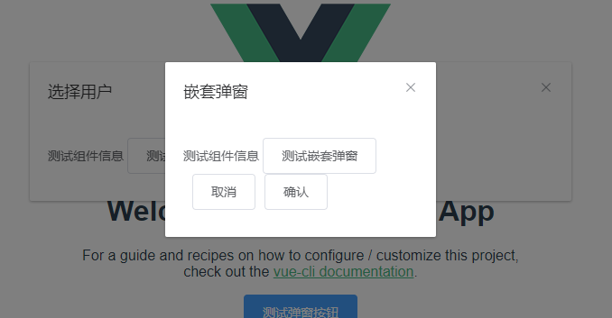

# Vue2+Elementui Dialog 封装自定义弹窗组件

## 前言

___

在日常的管理系统界面中，我们写的最多的除了列表表格之外,就是各种弹窗组件，如果将弹窗组件写在上下文的话，每个页面都需要编写大量重复的dialog代码已经频繁的创建控制显示隐藏的变量信息，即使将弹窗内展示信息抽取为组件，但是依旧有多个显隐变量需要操控，可想而知一个单页面文件会有多么庞大！！！

> 所以，我们可以将常用的弹窗组件封装后进行函数式调用,函数式调用的好处有以下几点
>
> 1. 无需全局加载，需要使用的地方引入方法即可
> 2. 无需定义显示隐藏变量，关闭组件时会自动销毁组件
> 3. 无需担心数据留存销毁问题，关闭时会随组件一起销毁
> 4. 单页面文件代码量下降，只需引入组件并在弹窗组件使用即可
> 5. 更多优点继续探索中...

___

## 效果预览



___

## 技术实现

定义弹窗组件文件夹,如果想要使用ts,请关注vue3自定义弹窗

```tree
-- Dialog
---- dialog.js
---- component.vue
```

定义component.vue,在编写时，曾考虑是使用**slot插槽**还是使用**component组件**，有这么一段话供各位参考

```text
Vue.js 是一款流行的 JavaScript 框架，它提供了多种方式来组织和构建您的应用程序。其中两个主要的方式是使用插槽（slots）和组件（components）。

插槽是 Vue.js 中一种非常强大的功能，它允许您在父组件中预留一些位置，然后在子组件中填充内容。这种方式可以很方便地实现动态组件和复杂布局。

组件是 Vue.js 中另一个核心概念，它允许您将应用程序拆分为更小、更易于维护的部分。组件是自包含的，可以拥有自己的状态、方法和生命周期钩子。

在选择使用插槽还是组件时，需要根据您的具体需求来决定。如果您的应用程序需要动态布局和灵活性，那么插槽可能是更好的选择。如果您的应用程序需要更好的可维护性和可复用性，那么组件可能是更好的选择。
```

所以最后还是考虑使用component编写，不为别的，就是好玩

```vue
<!-- el-dialog为elementui 2.5版本的组件，尚无拖拽弹窗功能，如需在vue2中添加拖拽功能，可以查看其他文档 -->
<!-- 测试后，此处el-dialog可以替换为antd或其他UI库dialog弹窗，同时也可以自己编写弹窗样式，皆可以满足调用 -->
<template>
    <el-dialog  append-to-body :title="title" :visible.sync="visible" v-bind="dialogOption">
    <!-- props传入到组件内数据，接受即可 -->
        <component :is="component" v-bind="props" @cancel="cancel" @confirm="confirm"></component>
    </el-dialog>
</template>
```

```javascript
<script>
let resolve = null
export default {
    data() {
        return {
            props: {},
            title: '',
            dialogOption: {},
            component: null,
            visible: true,
            onClose: () => { },
        }
    },
    methods: {
    //还可以更加精简，但是目前为了方便易懂，先如此处理
        open({ title, dialogOption, component, props, onClose }) {
            this.title = title
            this.dialogOption = dialogOption
            this.component = component
            this.props = props
            this.visible = true
            this.onClose = onClose
            //异步处理相关逻辑，未来可用
            return new Promise((resolse, reject) => {
                resolve = resolse
            })
        },
        confirm(arg) {
            this.close()
            resolve(arg)
        },
        cancel() {
            this.close()
            resolve()
        },
        close() {
            //调用回调close,回传传入的close方法，销毁组件
            this.visible = false
            this.$emit('close')
        }
    },
};
</script>
```

定义好组件后，需要定义调用组件的dialog.js方法

```js
import Component from './component.vue'
import Vue from 'vue'

//定义调用类
class Dialog {
    //定义相关实例，每次new Dialog的时候都会创建一个新的实例，这样弹窗之间就不会相互影响
    instance = null;
    component = null
    open(option) {
        //创建Vue实例，传入相关参数信息
        this.instance = new Vue({
            render(h) {
                return h(Component, { title: option.title }, option.chidren)
            }
        })
        //调用实例的$mount()挂载组件
        this.component = this.instance.$mount();
        document.body.appendChild(this.component.$el);
        const notification = this.instance.$children[0];
        return notification.open(option);
    }
    close() {
        //传入的销毁方法，直接在dom树上将当前组件直接销毁
        if (this.component) {
            document.body.removeChild(this.component.$el)
        }
        this.component = null
    }
}

export default Dialog
```

具体实现时，在使用弹窗的界面导入函数式弹窗组件及封装的数据展示弹窗，将有关参数传入即可

``` vue
<template>
<div>
    <p><el-button type="primary" @click="dialogDynamticFunc">测试按钮</el-button></p>
</div>
</template>

<script>
//引入封装组件及全局弹窗组件
import ChildComponent from './ChildComponent.vue'
import Dialog from './Dialog/dialog'
export default{
    methods:{
        dialogDynamticFunc() {
            let vueIns = this
            //new一个全局类
            let win = new Dialog()
            //调用open方法，传入相关参数
            win.open({
                 title: '选择用户',
                 dialogOption: { width: '600px' },
                 component: ChildComponent,
                 props: {
                            id: 1
                        },
                //定义回调关闭函数，
                 onClose: () => {
                 win.close()
             }
            })
            }
    }

}
</script>

```

___

## 总结

> 以上是在Vue2中封装自定义弹窗的相关Demo，编写起来其实并没有什么难度，主要是使用了Vue的全局实例及挂载销毁，主要还是要学习这种封装的思想，对自己的技术提升，对工作的一种经验总结，还是很有必要的
>
> 如果各位看完后，觉得有帮助，小心心走一走
> 如果有疑惑或者有什么新想法，请在评论区中描述，会尽快解答
